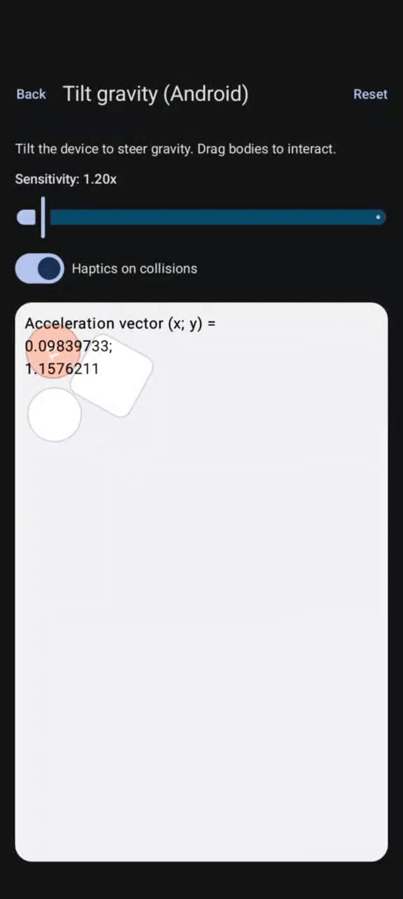
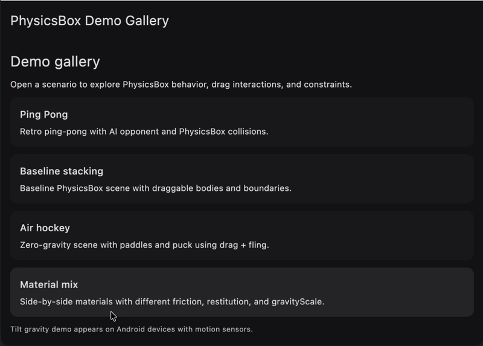

  [](https://github.com/jbox2d/jbox2d)
[](https://app.fossa.com/projects/git%2Bgithub.com%2FGoetzDeBouville%2FPhysicsBox?ref=badge_shield) [](https://central.sonatype.com/artifact/io.github.zinchenko-dev/physicsbox) [](https://central.sonatype.com/artifact/io.github.zinchenko-dev/physicsbox-android)

# PhysicsBox

PhysicsBox is a Compose Multiplatform physics layout container for Android and Desktop (JVM). It turns Composables into 2D physics bodies and renders their motion by applying translation and rotation during layout.

The runtime uses JBox2D on JVM platforms, giving you stable rigid‑body simulation with fixed‑timestep stepping, boundaries, dragging, and collision callbacks.

Inspired by [PhysicsLayout](https://github.com/Jawnnypoo/PhysicsLayout/).

## Demo Screencast

[](demoVideo/android_demo.mp4)
[](demoVideo/desktop_demo0.mp4)
[](demoVideo/desktop_demo2.mp4)

## Features
- Physics‑aware Compose container (`PhysicsBox`) with fixed‑timestep simulation.
- Simple body registration via `Modifier.physicsBody`.
- Shapes: rectangle, circle, polygon.
- World boundaries, gravity, damping, solver iterations.
- Pointer dragging with joint or direct control modes.
- Collision, drag, and step events.

## Documentation
Read [documentation](https://goetzdebouville.github.io/PhysicsBox/)

## Platforms
- Android (minSdk 23)
- Desktop (JVM)

## Requirements and limitations
- Compose Multiplatform (runtime/ui/foundation).
- JVM‑only physics backend (JBox2D). iOS/JS are **not** supported.

## TODO
- iOS target
- JS/WASM target

## Maven coordinates
Group: `io.github.zinchenko-dev`

Artifacts:
- `io.github.zinchenko-dev:physicsbox:<last_version>` — recommended for KMP `commonMain`.
- `io.github.zinchenko-dev:physicsbox-android:<last_version>` — Android‑only projects.
- `io.github.zinchenko-dev:physicsbox-desktop:<last_version>` — Desktop/JVM‑only projects.

Choose the common artifact for KMP so Android and Desktop can share the same API. Use the platform‑specific artifacts only when you are building a single‑platform app.

## Installation (Gradle Kotlin DSL)
Add Maven Central:
```kotlin
repositories {
    mavenCentral()
}
```

KMP (commonMain):
```kotlin
kotlin {
    sourceSets {
        val commonMain by getting {
            dependencies {
                implementation("io.github.zinchenko-dev:physicsbox:<last_version>")
            }
        }
    }
}
```

Android‑only:
```kotlin
dependencies {
    implementation("io.github.zinchenko-dev:physicsbox-android:<last_version>")
}
```

Desktop‑only:
```kotlin
dependencies {
    implementation("io.github.zinchenko-dev:physicsbox-desktop:<last_version>")
}
```

## Samples
Android:
- To run the application on android device/emulator, open the project in Android Studio and run the imported android run configuration.
- To build the application bundle, run `./gradlew :androidApp:assembleDebug` and find the APK at `androidApp/build/outputs/apk/debug/androidApp-debug.apk`.

Desktop:
- Run the desktop application: `./gradlew :desktopApp:run`
- Run the desktop hot reload application: `./gradlew :desktopApp:hotRun --auto`

## License
[Apache-2.0](https://github.com/GoetzDeBouville/PhysicsBox?tab=Apache-2.0-1-ov-file)


[](https://app.fossa.com/projects/git%2Bgithub.com%2FGoetzDeBouville%2FPhysicsBox?ref=badge_large)

## Contributors 📢

<a href="https://github.com/GoetzDeBouville/PhysicsBox/graphs/contributors">
    
</a>